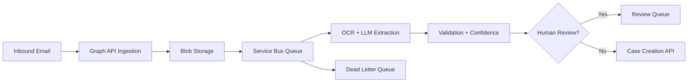

# Email-to-Case GenAI Automation

Event-driven GenAI automation pattern for converting inbound emails and
attachments into validated case-creation payloads.

This repository models a production architecture using Azure-style components:
email ingestion, blob persistence, OCR/document extraction, LLM field extraction,
retry handling, dead-letter routing, and human review.

## Business Problem

Operations teams often process high volumes of inbound emails and attachments
to create case records. Manual processing slows response time and introduces
inconsistent data entry. This project demonstrates an automation design for
structured case creation with safety controls.

## Architecture



## Quick Start

```bash
python -m src.demo
python -m unittest discover -s tests
```

## Included POC Code

- Email classification and priority detection
- Deterministic field extraction for requester, reference ID, and artifact hints
- Idempotency key generation for event-driven retry safety
- Confidence scoring, validation errors, audit trail, and review routing
- Sample inbound email in `examples/inbound_email.json`

## Production Extensions

- Microsoft Graph API email ingestion
- Azure Functions event handlers
- Azure Service Bus queue and DLQ
- Azure Blob Storage for raw artifacts
- Azure OpenAI extraction prompts
- TrackOps or CRM case creation API
