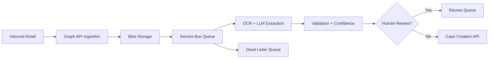

# Email-to-Case GenAI Automation

Event-driven GenAI automation pattern for converting inbound emails and
attachments into validated case-creation payloads.

This repository models a production architecture using Azure-style components:
email ingestion, blob persistence, OCR/document extraction, LLM field extraction,
retry handling, dead-letter routing, and human review.

## Business Problem

Operations teams often process high volumes of inbound emails and attachments
to create case records. Manual processing slows response time and introduces
inconsistent data entry. This project demonstrates an automation design for
structured case creation with safety controls.

## Architecture Decisions and Tradeoffs

- **Decision:** Use event-driven processing with artifact storage, queue-backed
  workers, OCR/extraction, validation, and review routing.
- **Tradeoff:** Queues and idempotency add implementation complexity, but they
  make retries, DLQ handling, and human-review pauses safer than synchronous processing.
- **Expected scale:** Designed for bursty inbox workloads where ingestion should
  continue even when OCR, LLM extraction, or downstream case APIs slow down.
- **Cost strategy:** Run deterministic classification and validation first, then
  use LLM extraction only where unstructured context requires it.
- **Security strategy:** Store raw artifacts securely, redact sensitive values
  before logs/prompts, and keep source links for audit.
- **Operational strategy:** Monitor ingestion failures, DLQ depth, extraction
  confidence, review backlog, and case API latency.
- **Lessons learned:** Idempotency and field-level confidence are core platform
  requirements, not implementation details.

## Architecture



## Quick Start

```bash
python -m src.demo
python -m unittest discover -s tests
docker compose up --build
```

## Included POC Code

- Email classification and priority detection
- Deterministic field extraction for requester, reference ID, and artifact hints
- Idempotency key generation for event-driven retry safety
- Confidence scoring, validation errors, audit trail, and review routing
- Sample inbound email in `examples/inbound_email.json`

## Engineering Maturity

- Dockerfile and `docker-compose.yml` for local execution
- GitHub Actions workflow for unit tests
- `.env.example` for safe configuration hygiene
- Architecture overview in `docs/architecture.md`
- Production readiness notes in `docs/production-readiness.md`
- Security and governance guidance in `docs/security-and-governance.md`
- Security, monitoring, cost, and scalability considerations documented

## Production Extensions

- Microsoft Graph API email ingestion
- Azure Functions event handlers
- Azure Service Bus queue and DLQ
- Azure Blob Storage for raw artifacts
- Azure OpenAI extraction prompts
- TrackOps or CRM case creation API

## Flagship Deep Dive

See [docs/flagship-architecture.md](docs/flagship-architecture.md) for Azure
Service Bus flows, OCR pipeline, LLM extraction, case creation, retry design,
observability, scalability, security, cost analysis, operational runbooks, and
business-impact framing.
