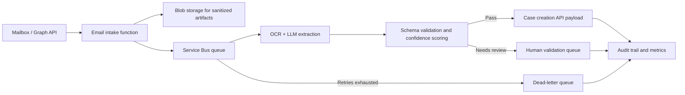

# Architecture Overview

This repository demonstrates a sanitized event-driven GenAI email-to-case automation pattern.

## Core Patterns

- Event-driven intake with asynchronous queue processing.
- Idempotency keys for email and attachment processing.
- Retry policies with a dead-letter queue for poison messages.
- Human-in-the-loop review for ambiguous extraction.
- Audit trail for every case creation decision.

## Production Extension Points

- Microsoft Graph API for mailbox ingestion.
- Azure Functions for processing steps.
- Service Bus for queueing, retry, and DLQ behavior.
- Blob Storage for attachments and extracted artifacts.
- TrackOps or another case-management API for final updates.
