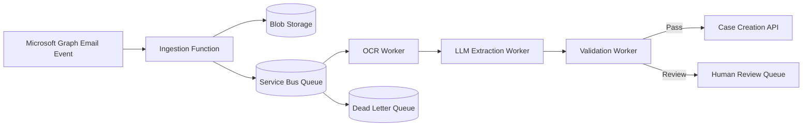
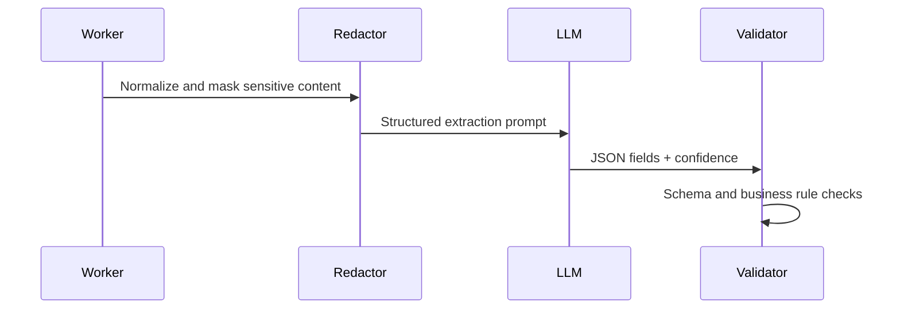

# Flagship Architecture: Email-to-Case GenAI Automation

## Business Impact

This architecture targets operational workflows where inbound emails and
attachments must become structured case records. The value is reduced manual
triage, more consistent extraction, better auditability, and safer routing of
uncertain cases to humans.

## Azure Service Bus Flow

## OCR Pipeline

1. Store source email and attachments.
2. Extract text and layout from supported files.
3. Normalize whitespace and remove unsafe logging fields.
4. Preserve source artifact links for audit.

## LLM Extraction Flow

## Case Creation Flow

- Build idempotency key from message ID.
- Validate title, requester, category, priority, and reference IDs.
- Route high-priority or low-confidence cases to review.
- Write only validated payloads to the downstream case API.

## Error Handling and Retry Design

- Retry transient OCR/LLM/API failures within a budget.
- Dead-letter poison messages with correlation ID and failure reason.
- Preserve raw artifacts so failed items can be replayed.
- Avoid duplicate cases through idempotency keys.

## Observability

- Correlation ID per email event.
- Metrics: ingestion rate, OCR failure rate, extraction confidence, review rate, DLQ depth, case API latency.
- Logs must exclude raw sensitive content.

## Scalability Strategy

- Scale ingestion and extraction workers independently.
- Partition queues by priority or tenant when volume grows.
- Use attachment checksum caching for repeated OCR.

## Security Design

- Store artifacts in encrypted storage.
- Restrict access to raw email and attachment content.
- Redact sensitive values before logs and model prompts where required.
- Require human approval for high-risk automation.

## Cost Analysis

- OCR and LLM calls are the primary variable costs.
- Run deterministic classification before LLM extraction.
- Cache OCR output by artifact hash.
- Use lower-cost models for routing and stronger models only for complex extraction.

## Operational Runbook

- DLQ growth: inspect top failure reasons, replay retryable items, route corrupt artifacts to review.
- Review backlog: adjust confidence threshold or staffing plan.
- LLM timeout spike: activate fallback extractor and increase review routing.

## Client Outcome Framing

Use this repository to discuss sanitized outcomes such as improved extraction
consistency, reduced manual triage, stronger auditability, and safer automation.
Do not claim private client metrics unless they are approved for sharing.
